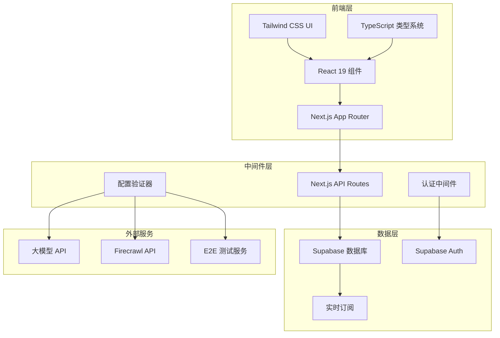

# 设计文档

## 概述

本设计文档描述了用户管理和配置系统的技术架构，该系统将为现有的Next.js应用添加完整的用户认证、配置管理和对话历史功能。系统采用现代化的技术栈，包括Next.js 15、React 19、Supabase、Tailwind CSS和TypeScript。

## 架构

### 整体架构图



### 技术栈选择

- **前端框架**: Next.js 15 (App Router) - 已有项目基础
- **UI 库**: React 19 - 已有项目基础  
- **样式**: Tailwind CSS v4 - 已有项目基础
- **类型系统**: TypeScript - 已有项目基础
- **数据库**: Supabase PostgreSQL - 提供认证和实时功能
- **认证**: Supabase Auth - 集成认证解决方案
- **状态管理**: React Context + useState/useReducer - 轻量级解决方案
- **表单验证**: Zod - 已有项目依赖

## 组件和接口

### 1. 认证系统组件

#### AuthProvider Context
```typescript
interface AuthContextType {
  user: User | null;
  loading: boolean;
  signIn: (email: string, password: string) => Promise<void>;
  signUp: (email: string, password: string) => Promise<void>;
  signOut: () => Promise<void>;
  resetPassword: (email: string) => Promise<void>;
}
```

#### 认证组件
- `LoginForm` - 登录表单组件
- `RegisterForm` - 注册表单组件  
- `ForgotPasswordForm` - 忘记密码表单
- `AuthGuard` - 路由保护组件

### 2. 配置管理组件

#### ConfigProvider Context
```typescript
interface ConfigContextType {
  llmConfig: LLMConfig;
  apiConfig: APIConfig;
  updateLLMConfig: (config: Partial<LLMConfig>) => Promise<void>;
  updateAPIConfig: (config: Partial<APIConfig>) => Promise<void>;
  testConnection: (type: 'llm' | 'firecrawl' | 'e2e') => Promise<boolean>;
}
```

#### 配置组件
- `LLMConfigPanel` - 大模型配置面板
- `APIConfigPanel` - API服务配置面板
- `ConfigurationTabs` - 配置选项卡容器
- `ConnectionTester` - 连接测试组件

### 3. 对话管理组件

#### ConversationProvider Context
```typescript
interface ConversationContextType {
  conversations: Conversation[];
  currentConversation: Conversation | null;
  createConversation: (title?: string) => Promise<Conversation>;
  deleteConversation: (id: string) => Promise<void>;
  renameConversation: (id: string, title: string) => Promise<void>;
  loadConversation: (id: string) => Promise<void>;
  searchConversations: (query: string) => Conversation[];
}
```

#### 对话组件
- `ConversationList` - 对话列表组件
- `ConversationItem` - 单个对话项组件
- `ConversationSearch` - 对话搜索组件
- `ConversationHistory` - 历史记录组件

### 4. 布局和导航组件

#### 主要布局组件
- `AppLayout` - 应用主布局
- `Sidebar` - 侧边栏导航
- `Header` - 顶部导航栏
- `UserMenu` - 用户菜单下拉

## 数据模型

### 1. 用户相关表

#### users 表 (Supabase Auth 扩展)
```sql
CREATE TABLE user_profiles (
  id UUID REFERENCES auth.users(id) PRIMARY KEY,
  email TEXT NOT NULL,
  display_name TEXT,
  avatar_url TEXT,
  created_at TIMESTAMP WITH TIME ZONE DEFAULT NOW(),
  updated_at TIMESTAMP WITH TIME ZONE DEFAULT NOW()
);
```

#### user_preferences 表
```sql
CREATE TABLE user_preferences (
  id UUID DEFAULT gen_random_uuid() PRIMARY KEY,
  user_id UUID REFERENCES user_profiles(id) ON DELETE CASCADE,
  theme TEXT DEFAULT 'light',
  language TEXT DEFAULT 'zh-CN',
  timezone TEXT DEFAULT 'Asia/Shanghai',
  created_at TIMESTAMP WITH TIME ZONE DEFAULT NOW(),
  updated_at TIMESTAMP WITH TIME ZONE DEFAULT NOW()
);
```

### 2. 配置相关表

#### llm_configurations 表
```sql
CREATE TABLE llm_configurations (
  id UUID DEFAULT gen_random_uuid() PRIMARY KEY,
  user_id UUID REFERENCES user_profiles(id) ON DELETE CASCADE,
  name TEXT NOT NULL,
  provider TEXT NOT NULL, -- 'openai', 'anthropic', 'groq', etc.
  api_url TEXT NOT NULL,
  api_key_encrypted TEXT NOT NULL,
  model_name TEXT NOT NULL,
  temperature DECIMAL(3,2) DEFAULT 0.7,
  max_tokens INTEGER DEFAULT 4000,
  is_default BOOLEAN DEFAULT FALSE,
  created_at TIMESTAMP WITH TIME ZONE DEFAULT NOW(),
  updated_at TIMESTAMP WITH TIME ZONE DEFAULT NOW()
);
```

#### api_configurations 表
```sql
CREATE TABLE api_configurations (
  id UUID DEFAULT gen_random_uuid() PRIMARY KEY,
  user_id UUID REFERENCES user_profiles(id) ON DELETE CASCADE,
  service_type TEXT NOT NULL, -- 'firecrawl', 'e2e', etc.
  name TEXT NOT NULL,
  base_url TEXT NOT NULL,
  api_key_encrypted TEXT,
  config_json JSONB, -- 额外配置参数
  is_active BOOLEAN DEFAULT TRUE,
  created_at TIMESTAMP WITH TIME ZONE DEFAULT NOW(),
  updated_at TIMESTAMP WITH TIME ZONE DEFAULT NOW()
);
```

### 3. 对话相关表

#### conversations 表
```sql
CREATE TABLE conversations (
  id UUID DEFAULT gen_random_uuid() PRIMARY KEY,
  user_id UUID REFERENCES user_profiles(id) ON DELETE CASCADE,
  title TEXT NOT NULL,
  description TEXT,
  tags TEXT[],
  is_archived BOOLEAN DEFAULT FALSE,
  created_at TIMESTAMP WITH TIME ZONE DEFAULT NOW(),
  updated_at TIMESTAMP WITH TIME ZONE DEFAULT NOW()
);
```

#### messages 表
```sql
CREATE TABLE messages (
  id UUID DEFAULT gen_random_uuid() PRIMARY KEY,
  conversation_id UUID REFERENCES conversations(id) ON DELETE CASCADE,
  role TEXT NOT NULL, -- 'user', 'assistant', 'system'
  content TEXT NOT NULL,
  metadata JSONB, -- 额外元数据
  created_at TIMESTAMP WITH TIME ZONE DEFAULT NOW()
);
```

### 4. 索引和约束

```sql
-- 性能优化索引
CREATE INDEX idx_conversations_user_id ON conversations(user_id);
CREATE INDEX idx_conversations_created_at ON conversations(created_at DESC);
CREATE INDEX idx_messages_conversation_id ON messages(conversation_id);
CREATE INDEX idx_messages_created_at ON messages(created_at);

-- 全文搜索索引
CREATE INDEX idx_conversations_search ON conversations USING gin(to_tsvector('english', title || ' ' || COALESCE(description, '')));
CREATE INDEX idx_messages_search ON messages USING gin(to_tsvector('english', content));

-- 唯一约束
ALTER TABLE llm_configurations ADD CONSTRAINT unique_default_per_user 
  EXCLUDE (user_id WITH =) WHERE (is_default = true);
```

## 错误处理

### 1. 认证错误处理

```typescript
enum AuthErrorType {
  INVALID_CREDENTIALS = 'invalid_credentials',
  USER_NOT_FOUND = 'user_not_found',
  EMAIL_ALREADY_EXISTS = 'email_already_exists',
  WEAK_PASSWORD = 'weak_password',
  SESSION_EXPIRED = 'session_expired',
  RATE_LIMITED = 'rate_limited'
}

interface AuthError {
  type: AuthErrorType;
  message: string;
  details?: any;
}
```

### 2. 配置错误处理

```typescript
enum ConfigErrorType {
  INVALID_API_KEY = 'invalid_api_key',
  CONNECTION_FAILED = 'connection_failed',
  INVALID_URL = 'invalid_url',
  QUOTA_EXCEEDED = 'quota_exceeded',
  SERVICE_UNAVAILABLE = 'service_unavailable'
}

interface ConfigError {
  type: ConfigErrorType;
  service: string;
  message: string;
  retryable: boolean;
}
```

### 3. 数据库错误处理

```typescript
enum DatabaseErrorType {
  CONNECTION_FAILED = 'connection_failed',
  QUERY_TIMEOUT = 'query_timeout',
  CONSTRAINT_VIOLATION = 'constraint_violation',
  PERMISSION_DENIED = 'permission_denied'
}
```

### 4. 错误边界组件

```typescript
interface ErrorBoundaryState {
  hasError: boolean;
  error?: Error;
  errorInfo?: ErrorInfo;
}

class AppErrorBoundary extends Component<Props, ErrorBoundaryState> {
  // 错误捕获和恢复逻辑
}
```

## 测试策略

### 1. 单元测试

- **组件测试**: 使用 React Testing Library 测试所有 UI 组件
- **Hook 测试**: 测试自定义 React Hooks 的逻辑
- **工具函数测试**: 测试配置验证、数据转换等工具函数
- **API 路由测试**: 测试 Next.js API 路由的业务逻辑

### 2. 集成测试

- **认证流程测试**: 测试完整的登录、注册、密码重置流程
- **配置管理测试**: 测试配置的保存、加载、验证流程
- **对话管理测试**: 测试对话的创建、删除、搜索功能
- **数据库集成测试**: 测试与 Supabase 的数据交互

### 3. 端到端测试

- **用户旅程测试**: 测试完整的用户使用流程
- **跨浏览器测试**: 确保在不同浏览器中的兼容性
- **响应式测试**: 测试在不同设备尺寸下的表现

### 4. 性能测试

- **加载性能测试**: 测试页面加载时间和首屏渲染
- **数据库查询性能**: 测试大量数据下的查询性能
- **实时功能性能**: 测试 Supabase 实时订阅的性能

## 安全考虑

### 1. 认证安全

- **密码策略**: 强制使用强密码，支持密码复杂度验证
- **会话管理**: 安全的 JWT token 管理，自动过期和刷新
- **多因素认证**: 支持邮箱验证和可选的 2FA
- **账户锁定**: 防止暴力破解攻击

### 2. 数据安全

- **数据加密**: 敏感数据（API 密钥）使用 AES 加密存储
- **传输安全**: 强制使用 HTTPS，启用 HSTS
- **输入验证**: 所有用户输入使用 Zod 进行严格验证
- **SQL 注入防护**: 使用 Supabase 的参数化查询

### 3. API 安全

- **速率限制**: 实现 API 调用频率限制
- **CORS 配置**: 严格的跨域资源共享配置
- **API 密钥管理**: 安全的第三方 API 密钥存储和使用
- **请求验证**: 验证所有 API 请求的合法性

### 4. 前端安全

- **XSS 防护**: 使用 React 的内置 XSS 防护和内容安全策略
- **CSRF 防护**: 实现 CSRF token 验证
- **敏感数据处理**: 避免在客户端存储敏感信息
- **安全头部**: 配置适当的 HTTP 安全头部

## 性能优化

### 1. 前端性能

- **代码分割**: 使用 Next.js 的自动代码分割和动态导入
- **图片优化**: 使用 Next.js Image 组件进行图片优化
- **缓存策略**: 实现适当的浏览器缓存和 CDN 缓存
- **懒加载**: 对非关键组件实现懒加载

### 2. 数据库性能

- **查询优化**: 优化数据库查询，使用适当的索引
- **连接池**: 使用 Supabase 的连接池管理
- **数据分页**: 实现高效的数据分页加载
- **缓存层**: 在适当的地方添加 Redis 缓存

### 3. API 性能

- **响应缓存**: 缓存频繁请求的 API 响应
- **批量操作**: 支持批量数据操作以减少请求次数
- **压缩**: 启用 gzip 压缩减少传输数据量
- **CDN**: 使用 CDN 加速静态资源加载

## 部署和运维

### 1. 部署架构

- **前端部署**: Vercel 或 Netlify 部署 Next.js 应用
- **数据库**: Supabase 托管 PostgreSQL 数据库
- **环境管理**: 开发、测试、生产环境分离
- **CI/CD**: GitHub Actions 自动化部署流程

### 2. 监控和日志

- **错误监控**: 集成 Sentry 进行错误追踪
- **性能监控**: 使用 Vercel Analytics 监控性能
- **日志管理**: 结构化日志记录和分析
- **健康检查**: API 健康检查端点

### 3. 备份和恢复

- **数据备份**: Supabase 自动备份策略
- **配置备份**: 重要配置的版本控制
- **灾难恢复**: 制定灾难恢复计划
- **数据迁移**: 数据库迁移脚本和版本管理

## 可扩展性设计

### 1. 架构可扩展性

- **微服务准备**: 模块化设计便于未来拆分微服务
- **插件系统**: 支持第三方服务的插件化集成
- **API 版本控制**: 支持 API 版本管理和向后兼容
- **多租户支持**: 为未来的多租户需求预留设计

### 2. 功能可扩展性

- **配置系统**: 灵活的配置系统支持新的服务类型
- **权限系统**: 基于角色的权限控制系统
- **国际化**: 完整的多语言支持框架
- **主题系统**: 可定制的主题和样式系统

### 3. 数据可扩展性

- **分片策略**: 为大规模数据准备的分片策略
- **读写分离**: 支持数据库读写分离
- **缓存层**: 多级缓存架构
- **数据归档**: 历史数据归档策略